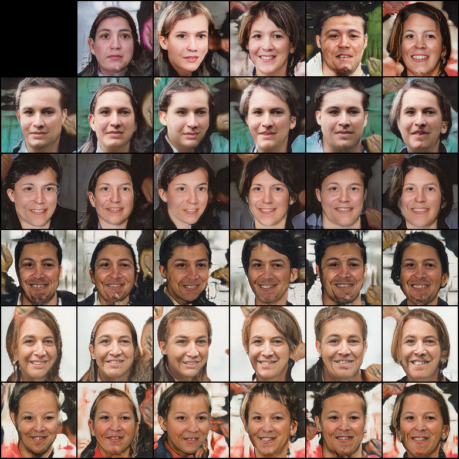
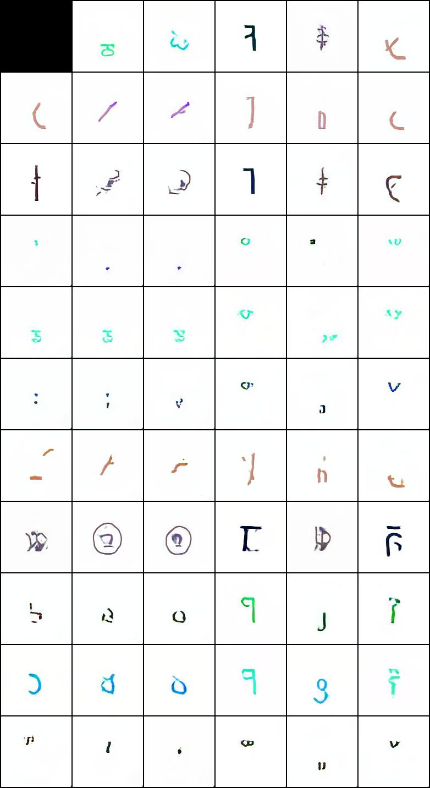
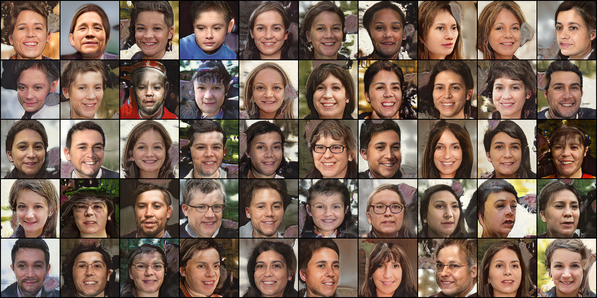
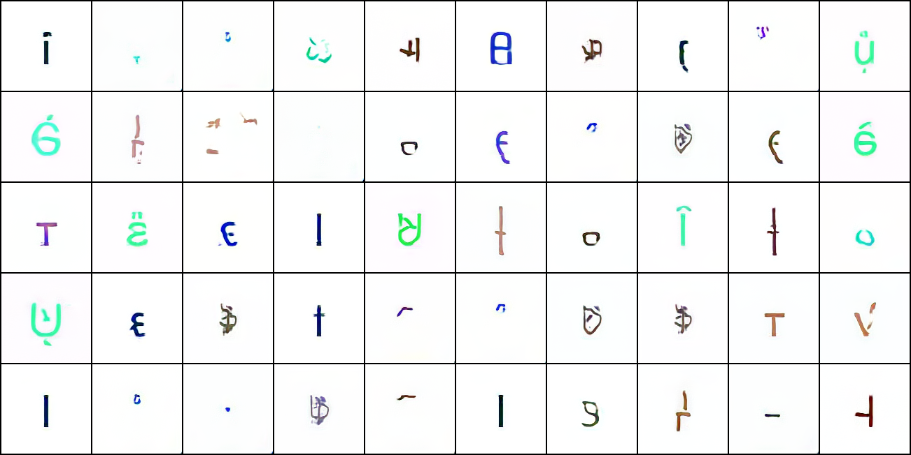

# stylegan-jt
Stylegan Implemented by jittor in Computer Graphics（Fall 2021）, Tsinghua Univ.

## Train the model
I trained the stylegan model on a standard symbol dataset and FFHQ dataset.
You can get these two dataset using the following instructions.
```
wget https://drive.google.com/file/d/1D8gV6sMqpgGc3dW2V9ihMw024adAXQlb/view?usp=sharing -O data/color_symbol_7k.zip 
#standard symbol dataset
wget https://drive.google.com/file/d/1bF2HDytK8W2NGiTip8ne_xEeViW3NNBy/view?usp=sharing -O data/FFHQ_data.zip 
#FFHQ dataset
```
Then you can unzip the dataset and preprocess them using the following instructions to get data of different resolutions.

Don't forget to make necessary modifications in [sh/preprocess.sh](sh/preprocess.sh) and [sh/preprocess_face.sh](sh/preprocess_face.sh) to adjust to your data path.
```
bash ./sh/preprocess.sh #standard symbol dataset
bash ./sh/preprocess_face.sh #FFHQ dataset
```
After this you can train your own stylegan model on these two dataset using the following instructions.
```
bash ./sh/train.sh #standard symbol dataset
bash ./sh/train_face.sh #FFHQ dataset
```

## Test the model
After you have trained the stylegan model, you can run the following instructions to load the model and generate pictures by latent space interpolations.
```
bash ./sh/test.sh #standard symbol dataset
bash ./sh/test_face.sh #FFHQ dataset
```

Or you can just download my pretrained model and run the test instructions.
```
wget https://drive.google.com/file/d/1BnELx6p_b18m5Tv0d1OfI2lOSkyRALxK/view?usp=sharing -O ./checkpoints/symbol_80w_ckpt/800000.model
#standard symbol dataset
wget https://drive.google.com/file/d/1RxbLH3ErJP06glT1IJTIYSxeT5Kvu5b3/view?usp=sharing -O ./checkpoints/face_80w_ckpt/800000.model 
#FFHQ dataset
```

Here we show some latent space interpolations results on these two dataset. The first row and column are two groups of interpolated pictures and the other are interpolation results.
<center>
<table><tr>
    <td></td>
</tr></table>
</center>

<center>
<table><tr>
    <td></td>
</tr></table>
</center>

And we also generate some latent space interpolations results from a temporal view in order to generate a demo video, these pictures will be saved in [output/interpolation_80_80w](output/interpolation_80_80w)and [output/face_interpolation_80_80w](output/face_interpolation_80_80w).
The following are two samples.
<center>
<table><tr>
    <td></td>
    <td></td>
</tr></table>
</center>
## Demo


## Reference

+ [pytorch Implementation: style-based-gan-pytorch](https://github.com/rosinality/style-based-gan-pytorch)
+ [StyleGAN: A Style-Based Generator Architecture for Generative Adversarial Networks](https://arxiv.org/abs/1812.04948)
+ [StyleGAN-jittor: another jittor implementation of stylegan from xUhEngwAng](https://github.com/xUhEngwAng/StyleGAN-jittor)
+ [Jittor: a novel deep learning framework with meta-operators and unified graph execution](https://cg.cs.tsinghua.edu.cn/jittor/papers/)
+ [Jittor Document](https://cg.cs.tsinghua.edu.cn/jittor/)
+ [StyleGAN - Official TensorFlow Implementation](https://github.com/NVlabs/stylegan)

## License
The files written by contributors in this project use [MIT LICENSE](LICENSE) open source without special instructions. This means that you may use, copy, modify, publish, and use the Project for commercial purposes at will, provided that this Open Source License must be included in all copies based on the Project and its derivatives.

The copyright for the remainder belongs to the respective authors.

